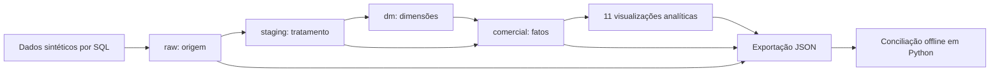

# Portfólio de Engenharia de Dados

## Projetos

- **Projeto 1 — Análise comercial:** BigQuery, SQL e conciliação em Python. Documentação e arquivos abaixo.
- **[Projeto 2 — Pipeline comercial orquestrado](projeto-02-pipeline-comercial/README.md):** PostgreSQL, REST API, Python, Airflow e BigQuery Sandbox. Base sintética com 5.000 vendas, metas e devoluções; carga incremental, watermarks, idempotência e bloqueio por qualidade validados.

## Projeto 1 — Análise comercial

Demonstração de análise comercial com **BigQuery, SQL e Python**, dados sintéticos e reprodução offline. Desenvolvido por **Matheus Dressbach**.

O projeto transforma vendas, metas e previsões em indicadores de faturamento, margem, clientes e desempenho comercial. A execução no BigQuery Sandbox foi validada em **29/09/2026**, na região de **São Paulo** (`southamerica-east1`).

## Resultados

| Evidência | Resultado |
|---|---:|
| Tabelas criadas | 19 |
| Visualizações analíticas | 11 |
| Registros exportados, somando os 30 objetos | 5.642 |
| Lançamentos de venda | 848 |
| Lançamentos faturados | 827 |
| Meses analisados | 18 |
| Faturamento sintético | R$ 3.282.277,00 |
| Margem bruta sintética | R$ 1.363.789,70 |
| Testes locais | 5 aprovados |

## Arquitetura implementada



As visualizações incluem indicadores executivos, desempenho de vendedores, curva ABC, inatividade e concentração de clientes, retração, erosão de margem e acurácia de previsão.

## Reproduzir sem internet ou conta Google

Baixe o repositório em **Code → Download ZIP**, extraia o arquivo e abra um terminal na pasta extraída. Com Python 3 instalado:

```sh
python3 reproduzir_offline.py
python3 testar_validacao.py
```

Não exige bibliotecas adicionais. O primeiro comando reconstrói vendas a partir da camada raw exportada, confere cada lançamento e concilia os indicadores mensais com o BigQuery. Os resultados são gravados na pasta `resultados/`.

O segundo comando verifica o snapshot válido e a detecção de quatro erros introduzidos em memória: preço negativo, cliente inexistente, valor incorreto na fato e agregado mensal incorreto. Os dados originais não são modificados.

## Explorar os arquivos

- [Estudo de caso e decisões técnicas](estudo-de-caso.md)
- [Carga sintética e modelagem](01-carga-sandbox-executada.sql)
- [Visualizações e indicadores](02-indicadores-sandbox.sql)
- [Consulta de exportação](03-exportacao.sql)
- [Reprodução no BigQuery](reproduzir-bigquery.md)
- [Dados exportados](exportacao-bigquery.json) e [indicadores mensais](indicadores-mensais.json)
- [Verificador Python](reproduzir_offline.py) e [testes](testar_validacao.py)
- [Resultado da validação](validacao.json)
- [Pacote estruturado original para download](portfolio-sem-custos-validado.zip)

Os arquivos estão na raiz para facilitar a navegação. O ZIP original mantém a organização em pastas e as instruções específicas daquela distribuição.

## Evidência de execução


## Custos e permanência

O projeto foi conferido sem conta de faturamento vinculada. A reprodução offline não faz chamadas à nuvem. No Sandbox, tabelas, visualizações e partições expiram em 60 dias; os arquivos deste repositório preservam a demonstração após essa expiração. Não existe recriação automática de recursos.

Consulte os limites atuais na [documentação oficial do BigQuery Sandbox](https://docs.cloud.google.com/bigquery/docs/sandbox?hl=pt-br) antes de reproduzir na nuvem.

## Escopo e próximos desenvolvimentos

Todos os dados e valores de negócio são **sintéticos**. Esta versão comprova modelagem analítica no BigQuery, execução das consultas e conciliação offline de vendas e indicadores executivos. A carga usa reconstrução completa por SQL.

Ingestão real de PostgreSQL/API, carga incremental e execução de Airflow **não foram realizadas**. São evoluções futuras da arquitetura V0.7. O dataset `controle` foi criado, mas está vazio nesta demonstração. A execução das 11 visualizações foi confirmada; a conciliação independente cobre vendas e indicadores executivos mensais, não todas as regras comerciais.
