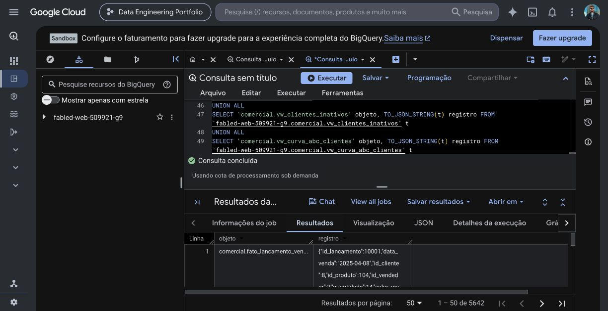

# Evidências do Projeto 1

O escopo do Projeto 1 está concluído: modelagem em camadas, indicadores comerciais no BigQuery e conciliação independente em Python. A orquestração e a ingestão incremental foram entregues no [Projeto 2](projeto-02-pipeline-comercial/README.md).

## Execução no BigQuery

Captura histórica da execução validada em 29/09/2026: exportação dos 30 objetos, com 5.642 registros. Os dados são sintéticos. A imagem documenta aquela execução; não representa uma nova carga.

## Conciliação e testes

[Resultado estruturado da conciliação](validacao.json): 848 lançamentos, 18 meses, faturamento de R$ 3.282.277,00 e margem bruta de R$ 1.363.789,70.

A suíte foi executada novamente em 06/10/2026 sobre os arquivos baixados do GitHub: cinco testes aprovados. Valida o snapshot correto e rejeita preço negativo, cliente ausente, valor adulterado na fato e agregado mensal adulterado. Veja [registro dessa verificação](testes-projeto-1-2026-10-06.txt).
