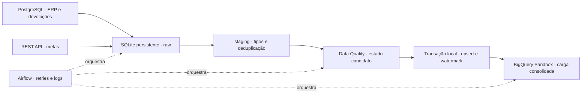

# Pipeline comercial: vendas, metas e devoluções

Uma distribuidora precisa reunir os lançamentos do ERP e as metas do planejamento
comercial, capturar correções e impedir que reexecuções dupliquem resultados.
Este projeto integra PostgreSQL e uma REST API com Python e Apache Airflow,
valida os dados antes de publicar e disponibiliza tabelas analíticas no BigQuery.
Todos os dados são sintéticos.

A base ampliada reúne cerca de 5 mil lançamentos em 12 meses, 200 clientes,
40 produtos, 12 vendedores, metas mensais e 180 devoluções. Vendas anuladas usam
`cancelado`; devoluções são eventos vinculados a vendas que foram realizadas.
As dimensões seguem `dm.dim_vendedores`, `dm.dim_clientes`, `dm.dim_produtos`;
os fatos ficam em `comercial.fato_lancamento_vendas`,
`comercial.fato_metas_vendedores` e `comercial.fato_devolucoes`.

## Arquitetura executada sem faturamento



O modo padrão é `local`. No modo `sandbox`, a última tarefa consulta a Cloud Billing
API e exige um projeto sem faturamento vinculado antes de carregar as seis tabelas.
O incremental e os watermarks ficam locais; o Sandbox recebe tabelas consolidadas
por batch load com substituição, sem MERGE. Uma falha de sincronização pode ser
reexecutada sem refazer a publicação local. As seis cargas não formam uma transação:
consulte o resultado depois de concluir toda a sincronização.

A implementação alternativa `bigquery` inclui raw, staging, MERGE transacional e
controle no warehouse. Esse caminho requer faturamento e **não foi validado na
conta usada neste projeto**. A operação comprovada está no Sandbox.

## Rodar localmente

Com Docker Desktop em execução:

```sh
cp .env.example .env
docker compose up -d --build
docker compose run --rm testes
```

Abra [Airflow](http://localhost:8080), usuário `admin`, senha local `admin_local`.
A DAG `vendas_metas_diarias` começa pausada. Use uma execução manual para o primeiro
teste e mantenha-a pausada entre experimentos. O agendamento é 09:00 UTC.
Nas execuções manuais, a janela termina na data lógica do disparo; nas agendadas,
no fim do intervalo diário. O fim é preservado durante retries.

Para publicar no Sandbox, siga [Operação sem faturamento](docs/sandbox.md).
O `.env` e a pasta `secrets` não entram no Git. Não copie novamente `.env.example`
sobre um ambiente já configurado. PostgreSQL, Airflow e API rodam em Docker local;
não são provisionados serviços na nuvem.

## Ampliar a base existente

Siga [Base comercial ampliada](docs/base-ampliada.md). A migração é aditiva e a massa
preserva os lançamentos do teste inicial. Para gerar novamente o SQL:

```sh
PYTHONPATH=src python -m pipeline_comercial.populacao
```

O SQL usa o instante da carga como timestamp de atualização: datas comerciais
antigas não fazem o histórico importado escapar do incremental.

## Incremental, consistência e qualidade

- Cada entidade usa uma janela `[watermark − 5 minutos, fim)`, com paginação por
  timestamp e chave. A sobreposição absorve atrasos curtos e exige deduplicação.
- Raw preserva versões; staging converte tipos e mantém a versão mais recente.
  Alterar uma versão sem mudar o timestamp é rejeitado.
- A qualidade compara o lote com o estado publicado. Valida dimensões, dinheiro,
  cancelamentos, metas únicas e quantidade/valor acumulado das devoluções.
- Publicação local e avanço dos watermarks usam a mesma transação. Falha de qualidade
  conserva ambos. Dimensões são tipo 1 e exclusões físicas não são propagadas.
- Airflow usa uma execução ativa, duas novas tentativas, espera crescente e timeout.
  Logs registram etapa, entidade, quantidade e duração; XCom leva apenas identificadores
  e contagens. A API tem paginação, timeout e retries para erros temporários.

SQLite é persistido em volume e compartilhado pelas tarefas do LocalExecutor no
mesmo computador. Não use essa configuração em executores distribuídos. O estado
candidato é validado em memória, adequado ao volume deste case. Alterações de origem
retroativas além da sobreposição precisam de reconciliação; não há promessa de CDC.

## O que foi validado

A versão anterior à ampliação passou em **56 testes no Docker** e foi executada
com PostgreSQL, API, Airflow e BigQuery Sandbox. Conferimos carga inicial, incremento,
idempotência, falha de qualidade com dados/watermarks preservados e recuperação.
A base ampliada passou em **61 testes no Docker** e foi publicada no Sandbox.
As consultas confirmaram as seis contagens, 5.000 chaves de venda distintas e
os valores reconciliados com a massa gerada. A repetição dessa carga ampliada
pela DAG também foi confirmada, mantendo os totais e as 5.000 chaves únicas.

A análise de outubro/2025 a setembro/2026 foi reconciliada no BigQuery: 144
combinações distintas de vendedor/mês, receita após devoluções de R$ 3.983.777,61,
metas de R$ 3.900.960,00 e atingimento agregado de 102,12%.
Veja [Harmonização das metas](docs/harmonizacao-metas.md).

Veja [Validação](docs/validacao.md) e [Teste de qualidade](docs/teste-qualidade.md).
Os resultados pequenos (3 lançamentos e R$ 330,00) pertencem à etapa anterior.
O JSON de resultados esperados da base ampliada é um cálculo local reproduzível.

## Consultas e arquivos

- `sql/bigquery/desempenho_comercial.sql`: receita após devoluções e atingimento de metas.
- `sql/bigquery/conferir_base_ampliada.sql`: contagens, chaves únicas e totais.
- `src/pipeline_comercial/populacao.py`: gerador determinístico da massa.
- `src/pipeline_comercial/qualidade.py`: regras sobre o estado candidato.
- `dags/vendas_metas_diarias.py`: orquestração e recuperação.

Substitua `__PROJETO__` nas consultas pelo ID do seu projeto. O Sandbox expira tabelas;
preserve fontes locais e gere novamente os dados quando necessário.

Sem Docker, a demonstração e os testes centrais usam a biblioteca padrão:

```sh
PYTHONPATH=src python -m unittest discover -s tests -v
PYTHONPATH=src python -m pipeline_comercial.cli demo
```

A demonstração isolada usa outro cenário (4 lançamentos e R$ 600,00). O teste real da
DAG roda na imagem Airflow 2.11.2 com Python 3.11; a origem usa PostgreSQL 16.8.

## Publicação no GitHub

Veja o [roteiro de publicação](docs/publicacao-github.md) para incluir este projeto
no portfólio e conferir os arquivos antes do envio.
