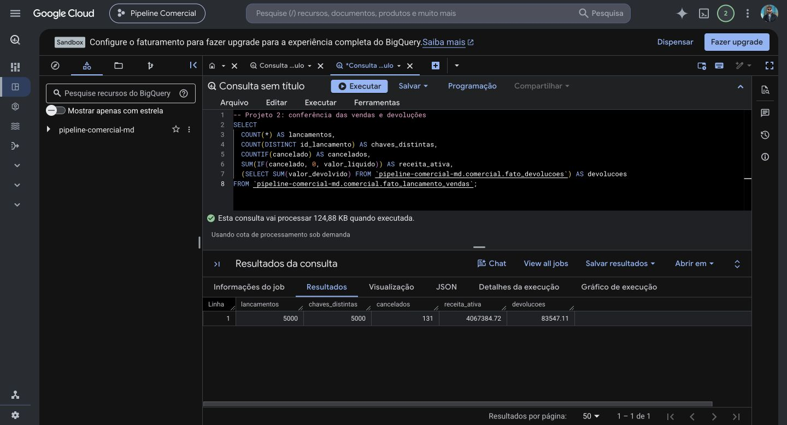
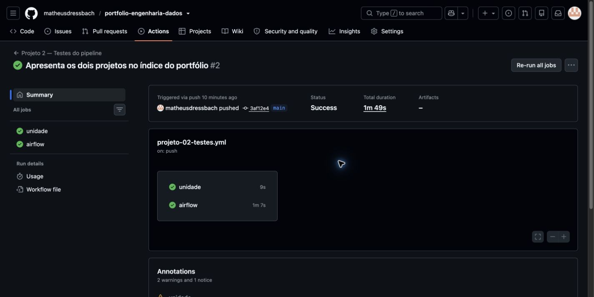
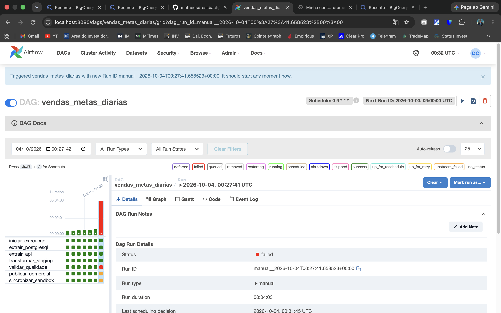
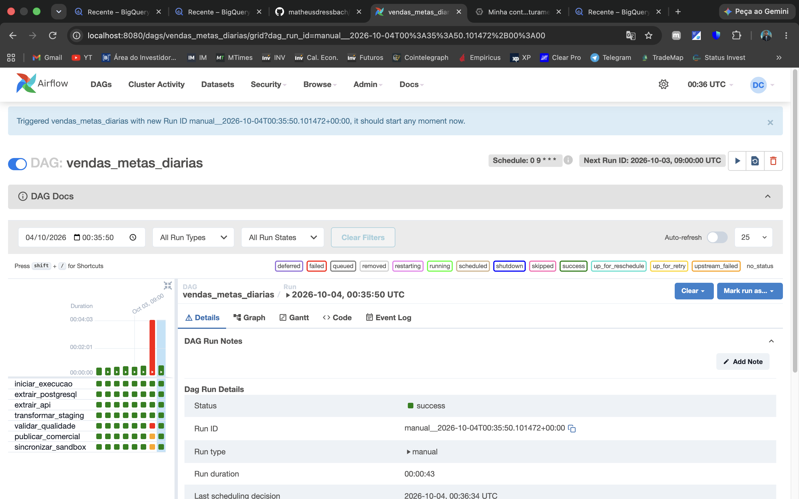
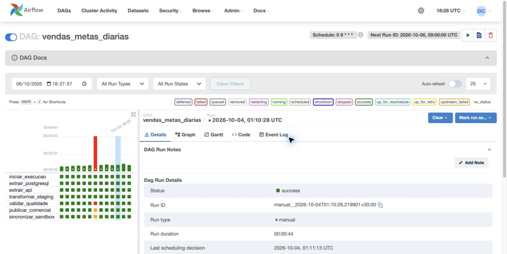

# Evidências visuais do Projeto 2

Os dados comerciais são sintéticos. As capturas abaixo registram as consultas e os testes feitos durante o desenvolvimento.

## Conferência no BigQuery Sandbox — 06/10/2026

Consulta executada novamente no projeto `pipeline-comercial-md`: 5.000 lançamentos e 5.000 chaves distintas, 131 cancelados, receita ativa de R$ 4.067.384,72 e devoluções de R$ 83.547,11. A captura mostra o Sandbox e o SQL; [consulta reproduzível](evidencias/consulta-totais.sql).

O total geral inclui a venda de teste de R$ 60 de outubro/2026. A análise da safra outubro/2025 a setembro/2026 exclui essa venda e tem receita após devoluções de R$ 3.983.777,61, conforme [reconciliação estruturada](evidencias/harmonizacao-confirmada.json).

## Testes automáticos no GitHub — 06/10/2026

[Execução 37509045684](https://github.com/matheusdressbach/portfolio-engenharia-dados/actions/runs/37509045684): os jobs `unidade` e `airflow` concluíram com sucesso. O segundo constrói a imagem Docker e testa a importação da DAG; não executa o pipeline contra a conta Google.

## Bloqueio por qualidade — captura histórica de 03/10/2026

A tarefa `validar_qualidade` falhou no cenário controlado de meta com vendedor sem dimensão. As tarefas de publicação e sincronização ficaram bloqueadas. [Comparação do estado](evidencias/qualidade-recuperacao.json) e [roteiro do teste](teste-qualidade.md) documentam a preservação dos dados publicados e dos watermarks.

## Recuperação — captura histórica de 03/10/2026

Após corrigir a referência do vendedor na origem, uma nova execução concluiu as sete tarefas. A falha anterior permanece no histórico e permite comparar os estados. As duas capturas do teste de qualidade são de 03/10/2026; foram preservadas para mostrar a falha e a recuperação.

## Airflow acessível novamente — 06/10/2026

Após iniciar os serviços Docker, a interface voltou a responder. A captura foi feita em 06/10/2026 e mostra a execução histórica `manual__2026-10-04T01:10:28.219901+00:00`, concluída com sucesso em 44 segundos. Esta conferência não representa uma nova execução do DAG.
